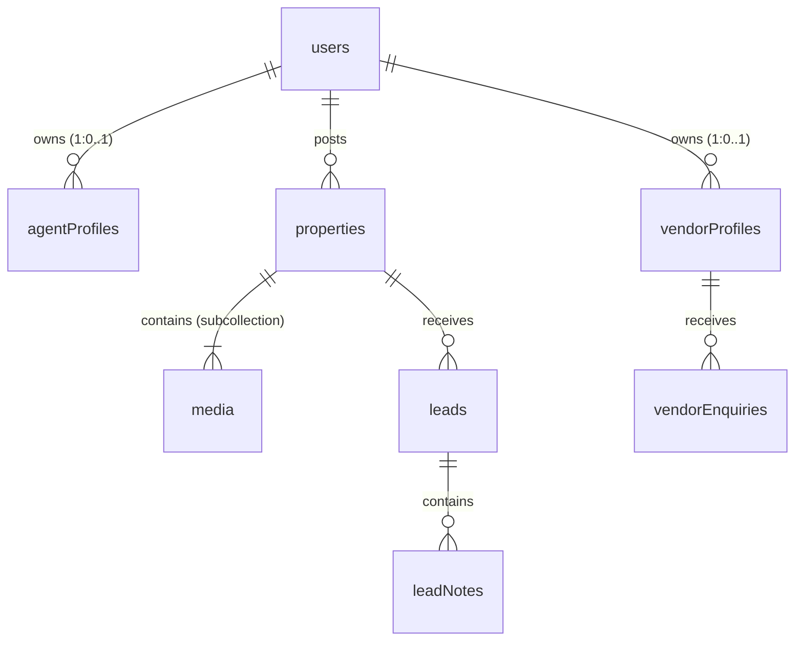
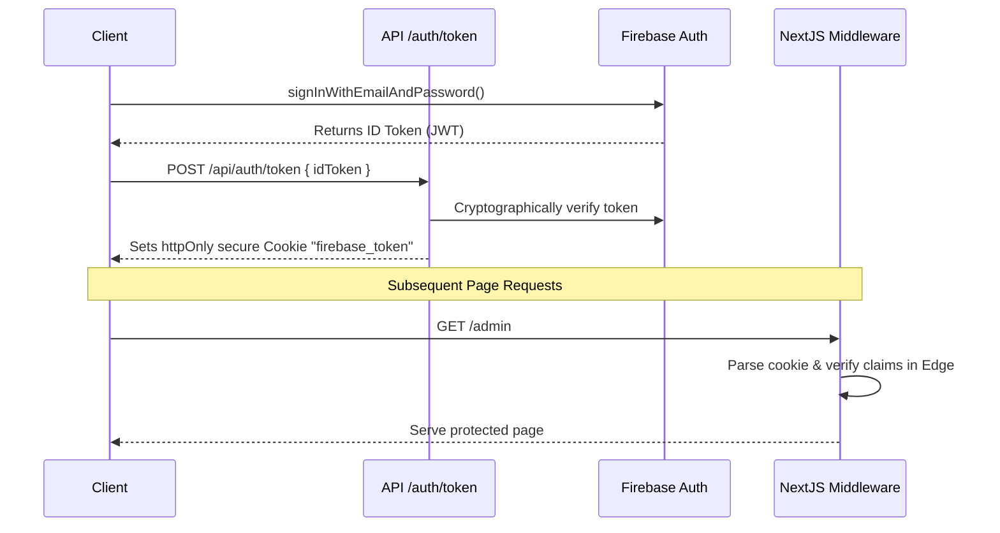

# Firebase Centric Architecture & Design Document

This document outlines the technical design of the new backend system for **DK Promoters**, migrated from Next.js + PostgreSQL/Prisma to a Firebase-centric cloud stack (Firestore, Firebase Authentication, Firebase Storage, and Hosting).

---

## 1. Database Schema Design (Firestore NoSQL)

All dynamic relational tables from the original schema are mapped to Firestore flat/nested collection designs:

### Collection Definitions

#### `users`
*   **Collection Path**: `/users/{uid}`
*   **Fields**:
    *   `name`: string (e.g., `'DK Promoters Admin'`)
    *   `email`: string (e.g., `'dkpromotersproperty@gmail.com'`)
    *   `phone`: string
    *   `role`: enum string (`'ADMIN' | 'AGENT' | 'VENDOR' | 'PROPERTY_LISTER'`)
    *   `accountStatus`: enum string (`'PENDING' | 'ACTIVE' | 'REJECTED' | 'SUSPENDED'`)
    *   `createdAt`: Timestamp
    *   `updatedAt`: Timestamp

#### `agentProfiles`
*   **Collection Path**: `/agentProfiles/{uid}`
*   **Fields**:
    *   `userId`: string (foreign reference matching user `uid`)
    *   `fullName`: string
    *   `mobile`: string
    *   `reraNumber`: string | null
    *   `officeAddress`: string
    *   `operatingCities`: array of strings
    *   `experience`: number (Years)
    *   `bio`: string | null
    *   `createdAt`: Timestamp
    *   `updatedAt`: Timestamp
    *   **Subcollection**: `media` (Agent portfolio images/videos)

#### `vendorProfiles`
*   **Collection Path**: `/vendorProfiles/{uid}`
*   **Fields**:
    *   `userId`: string (foreign reference matching user `uid`)
    *   `businessName`: string
    *   `ownerName`: string
    *   `mobile`: string
    *   `email`: string
    *   `category`: enum string (e.g., `'BUILDER' | 'INTERIOR_DESIGNER'`)
    *   `description`: string
    *   `serviceAreas`: array of strings
    *   `yearsInBusiness`: number
    *   `priceRangeMin`: number | null
    *   `priceRangeMax`: number | null
    *   `isVerified`: boolean
    *   `isFeatured`: boolean
    *   `createdAt`: Timestamp
    *   `updatedAt`: Timestamp
    *   **Subcollection**: `media` (Vendor portfolio images/videos)

#### `properties`
*   **Collection Path**: `/properties/{propertyId}`
*   **Fields**:
    *   `title`: string
    *   `description`: string
    *   `type`: enum string (`'APARTMENT' | 'VILLA' | 'HOUSE' | 'PLOT' | 'COMMERCIAL' | 'WAREHOUSE' | 'FARM_LAND' | 'PG_HOSTEL'`)
    *   `listingType`: enum string (`'BUY' | 'SELL' | 'RENT' | 'LEASE'`)
    *   `price`: number
    *   `priceUnit`: enum string (`'TOTAL' | 'PER_SQFT' | 'PER_MONTH' | 'PER_YEAR'`)
    *   `area`: number (sqft)
    *   `bedrooms`: number | null
    *   `bathrooms`: number | null
    *   `address`: string
    *   `locality`: string
    *   `city`: string
    *   `district`: string
    *   `pincode`: string | null
    *   `latitude`: number | null
    *   `longitude`: number | null
    *   `amenities`: array of strings
    *   `isFeatured`: boolean
    *   `status`: enum string (`'PENDING' | 'ACTIVE' | 'SOLD' | 'RENTED' | 'REJECTED' | 'INACTIVE'`)
    *   `viewCount`: number
    *   `postedById`: string (user uid)
    *   `createdAt`: Timestamp
    *   `updatedAt`: Timestamp
    *   **Subcollection**: `media` (Property images/videos)
        *   `url`: string
        *   `type`: `'IMAGE' | 'VIDEO'`
        *   `publicId`: string
        *   `thumbnailUrl`: string | null
        *   `order`: number
        *   `createdAt`: Timestamp

#### `leads`
*   **Collection Path**: `/leads/{leadId}`
*   **Fields**:
    *   `propertyId`: string (associated property doc id)
    *   `name`: string
    *   `email`: string
    *   `message`: string (confidential buyer details)
    *   `status`: enum string (`'NEW' | 'CONTACTED' | 'SITE_VISIT' | 'NEGOTIATION' | 'CLOSED' | 'LOST'`)
    *   `source`: enum string (`'WEB' | 'WHATSAPP' | 'MANUAL'`)
    *   `assignedToId`: string | null (admin/agent uid)
    *   `createdAt`: Timestamp
    *   `updatedAt`: Timestamp

#### `leadNotes`
*   **Collection Path**: `/leadNotes/{noteId}`
*   **Fields**:
    *   `leadId`: string
    *   `note`: string
    *   `createdAt`: Timestamp

#### `commissions`
*   **Collection Path**: `/commissions/{commissionId}`
*   **Fields**:
    *   `propertyId`: string | null
    *   `leadId`: string | null
    *   `type`: enum string (`'PROPERTY_SALE' | 'PROPERTY_RENTAL' | 'VENDOR_REFERRAL' | 'OTHER'`)
    *   `amount`: number
    *   `status`: enum string (`'EXPECTED' | 'RECEIVED' | 'CANCELLED'`)
    *   `notes`: string | null
    *   `createdBy`: string (admin uid)
    *   `createdAt`: Timestamp

---

## 2. Authentication Flow

Firebase Authentication manages the user pool. Authenticated states are shared with Next.js Server Components and middleware via a secure, HTTP-only cookie (`firebase_token`).

---

## 3. Storage Folders & Permissions

Firebase Storage buckets hold all media structured under descriptive directories:

*   `/properties/{propertyId}/{fileName}`: Property photos and videos.
*   `/vendors/{vendorUid}/{fileName}`: Allied service provider portfolio items.
*   `/agents/{agentUid}/{fileName}`: Co-broker references.

Security rules restrict write operations to owners (matching custom tokens) and global admins.
